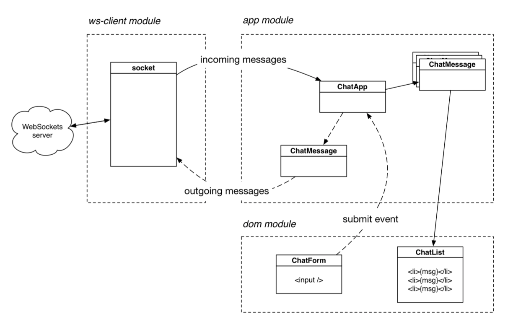

# WebsocketChatApp

A chat app experiment consisting of a Node.js server and a JavaScript app running in the browser.

## Configuration
#### Building
1. Navigate to the project root directory
2. run `$ npm install`
3. run `$ npm run dev` to start the node server with `nodemon` (auto server restart after file change)  
4. Open a new terminal tab and run `$ npm run watch` (auto-rebuild with babel compiler)

#### Executing
1. Open a new browser and navigate to http://localhost:3000/
2. Enter a  email address as your chat username
    * Ideally an email address bound to a [Gravatar](https://en.gravatar.com/) account
7. Each new browser tab kicks of a new socket stream, binding to `ws port 3001` connecting to chat room 1 by default
8. User starts in room 1, switch chat rooms with the dropdown

## Architecture

#### Server Side
###### HTTP server
   * Handle HTTP requests & transform file-paths  
   * Import websocket-server   
* **Websocket Server**
   * Listens to new client socket connections
   * Registers users and places them in rooms
   * Broadcasts messages and configures new users with message history

#### Client Side
###### App Module
   * Define the structure of messages
   * Pass messages between client socket class and DOM

###### DOM Module
   * Queries the DOM, and acts as interface to App module

###### Websocket Client Module
   * Manage WebSockets communication for the client
   * Connection handlers, message handlers etc.

## ToDo
* Better styling, throw away bootstrap
* Add cool chat features found in popular apps, such as, Slack
